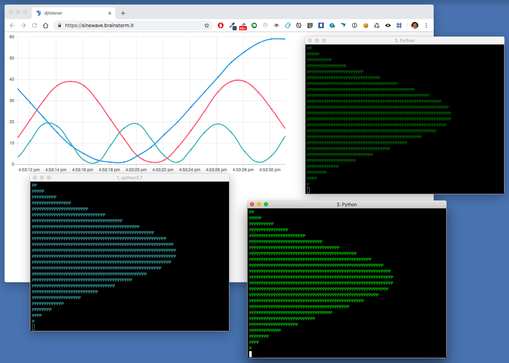
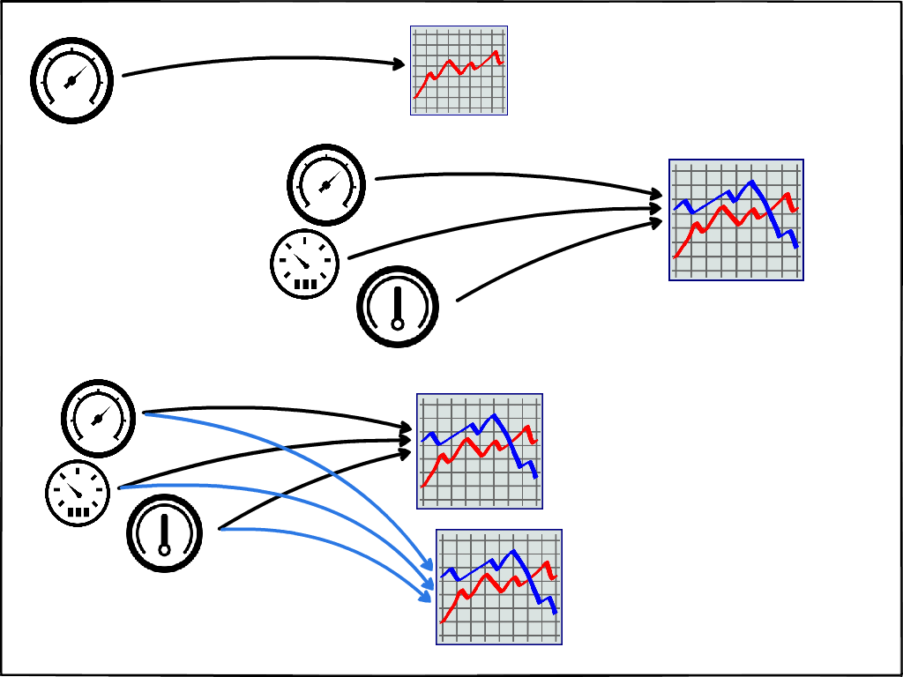
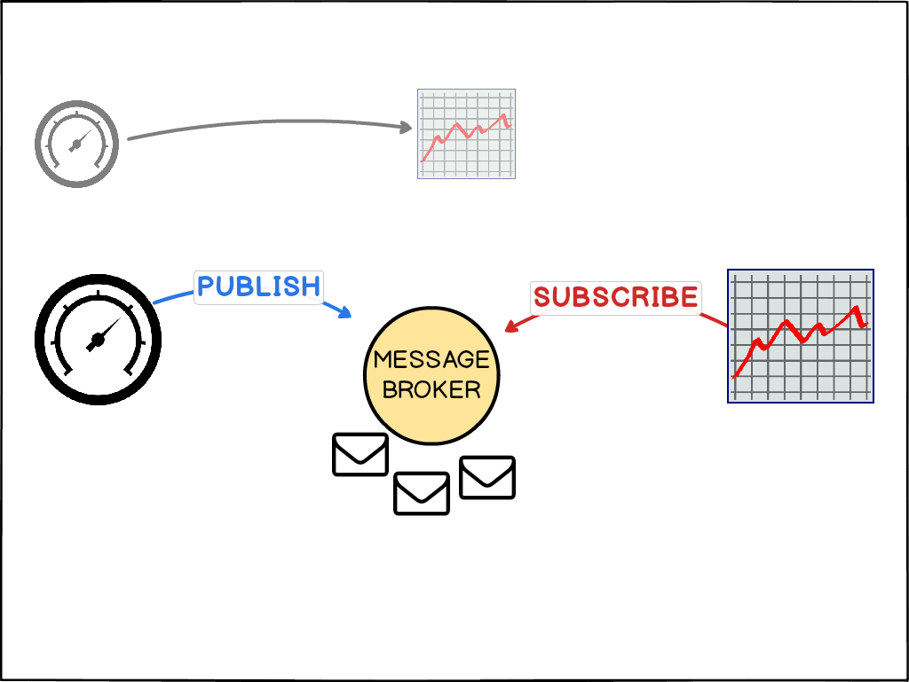
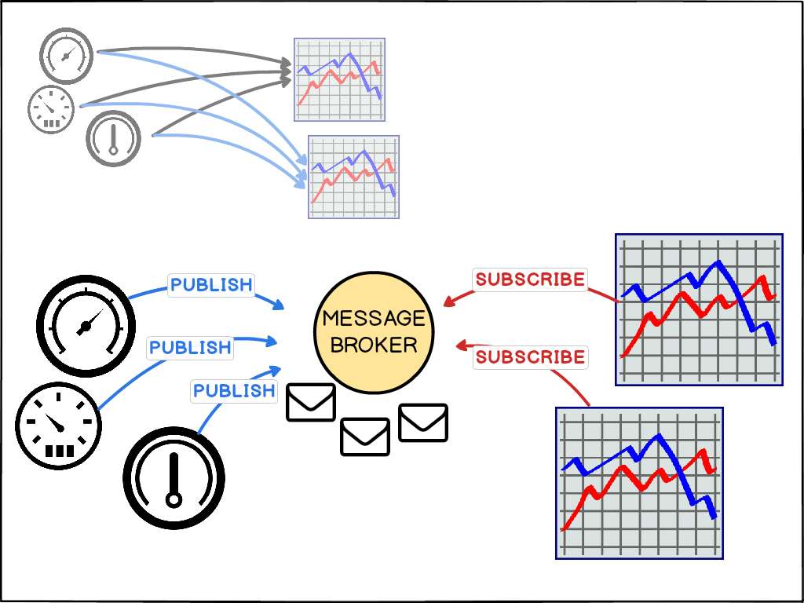
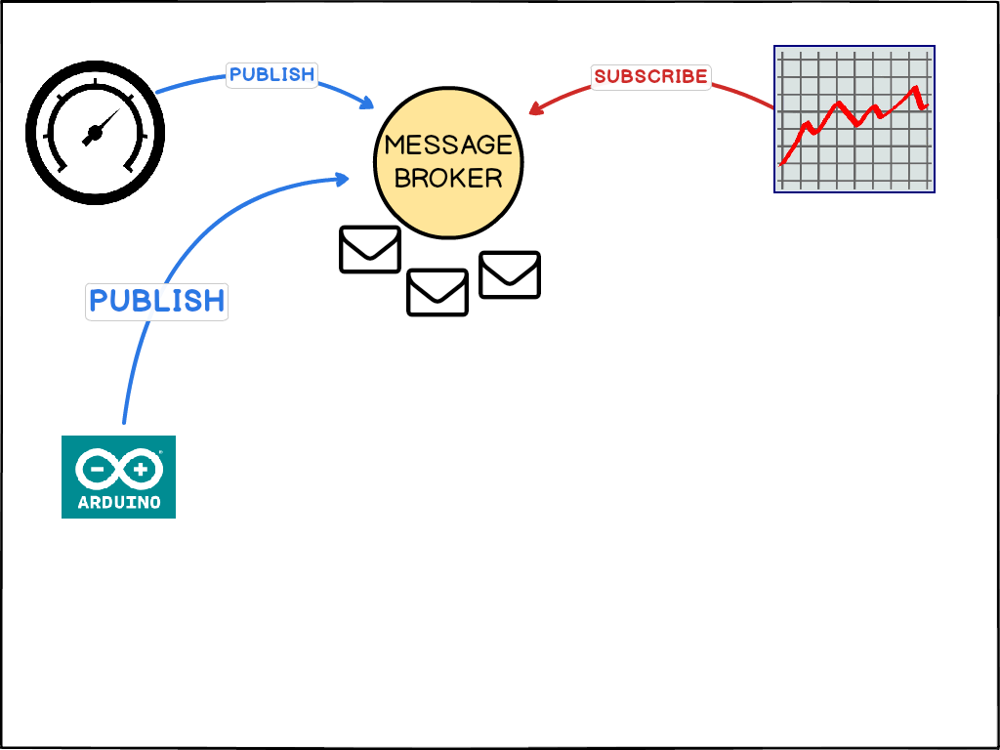
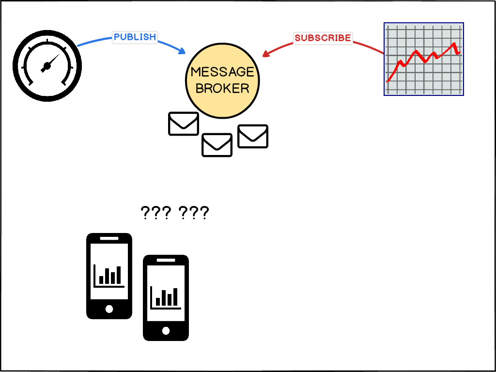
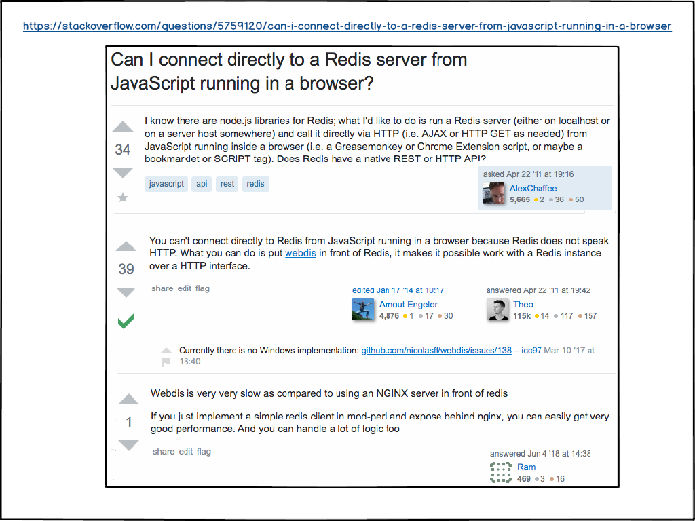
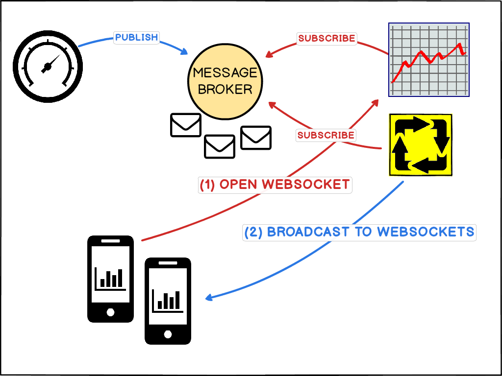
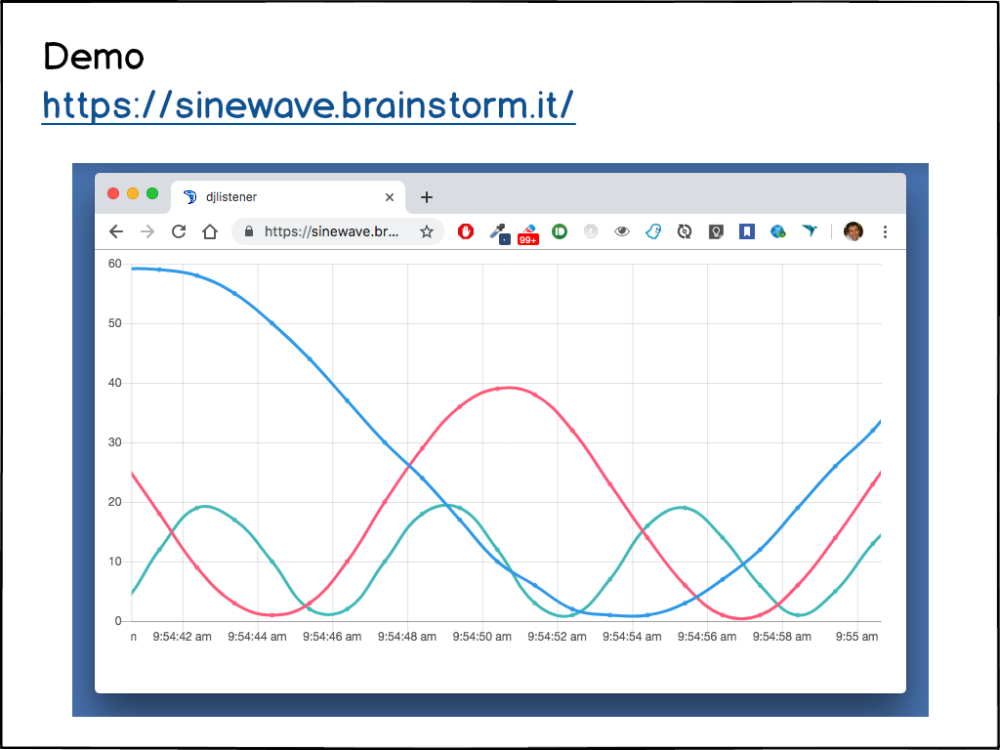

Sinewave
========

PyCon Italia 2019: Learn PUB/SUB with fun

Video:

Demo site: [https://sinewave.brainstorm.it](https://sinewave.brainstorm.it)

Screenshot:

Slides per PyCon X Italia 2019 (3/5/2019):

[etc/slides/2019-05-03_PyconItalia2019_sinewave.pdf](etc/slides/2019-05-03_PyconItalia2019_sinewave.pdf)

